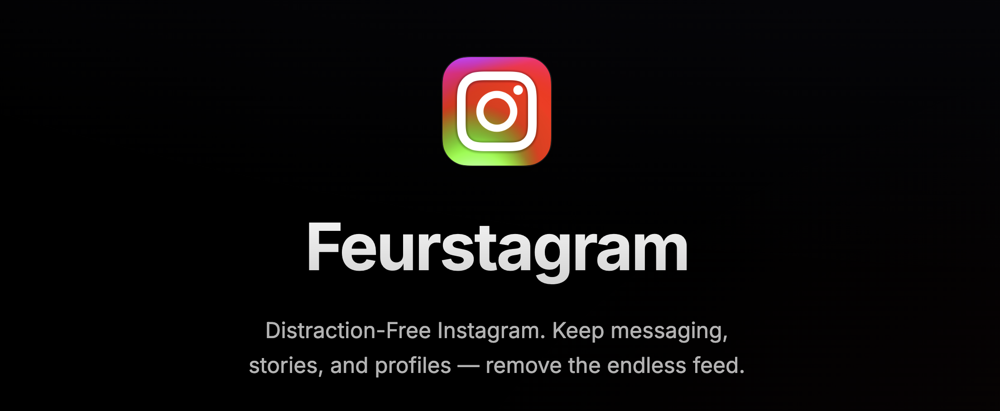
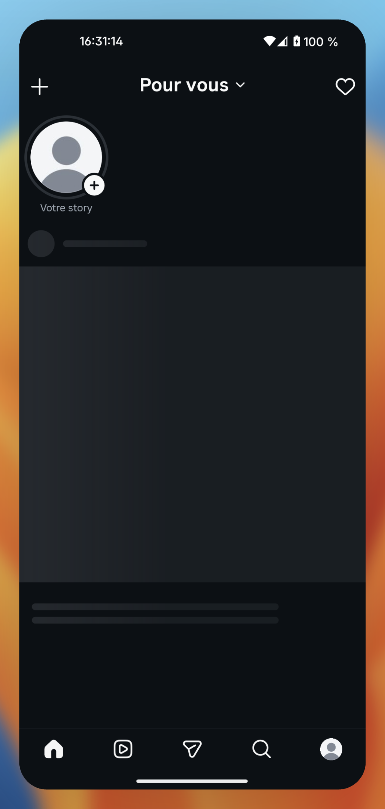
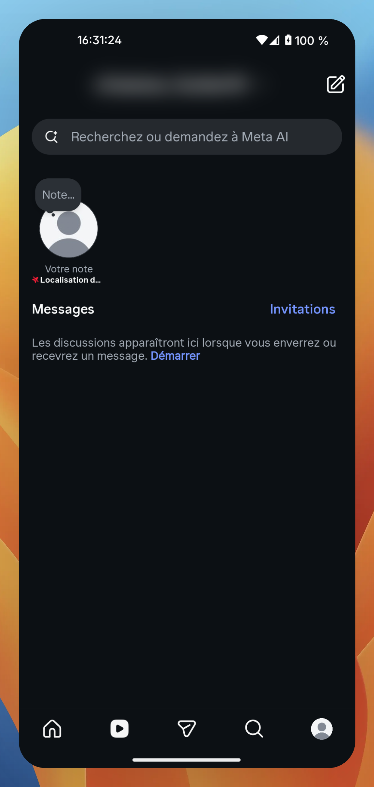
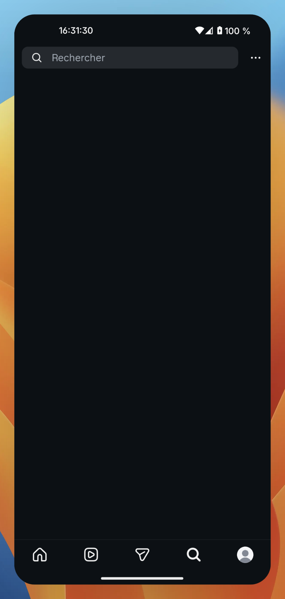

<p align="center">
  
</p>

<h1 align="center">iRetardgram</h1>
<p align="center">Distraction-Free Instagram</p>

<p align="center">
  <a href="https://github.com/brittytino/iRetardgram/releases/latest">
    
  </a>
  <a href="https://discord.gg/Z9QvMw8s76">
    
  </a>
</p>

<p align="center">
  <a href="https://github.com/brittytino/iRetardgram/actions/workflows/ci.yml">
    
  </a>
  <a href="https://github.com/brittytino/iRetardgram/actions/workflows/release.yml">
    
  </a>
  <a href="https://github.com/brittytino/iRetardgram/actions/workflows/pages.yml">
    
  </a>
</p>

<p align="center">
  
</p>

---

<p align="center">
  
</p>

<p align="center">
  
  
  
</p>

An open source Instagram app for Android without distractions.

This is not a passive fork mirror. This repository is an updated and advanced continuation maintained by TIno Britty J (brittytino).

Credits to original upstream owner and project:

- jean-voila - https://github.com/jean-voila/FeurStagram

## Community

Join the Discord server to get support, follow updates, and discuss development:

- https://discord.gg/Z9QvMw8s76

## Installation

You have two options:

1. Ready-to-install APK - Grab the latest APK from the Releases page and install it directly.
2. DIY patching - Use the toolkit below to patch any Instagram version yourself.

## What Gets Disabled

| Feature | Status | How |
|---------|--------|-----|
| Feed Posts | Blocked | Network-level blocking |
| Explore Content | Blocked | Network-level blocking |
| Reels Content | Redirected | Redirects to DMs |
| Analytics and telemetry | Blocked | See Blocked network paths |
| Shopping and commerce preloads | Blocked | See Blocked network paths |

## What Still Works

| Feature | Status |
|---------|--------|
| Stories | Works |
| Direct Messages | Works |
| Profile | Works |
| Reels in DMs | Works |
| Search | Works |
| Notifications | Works |

## Requirements

### Linux

```bash
sudo apt install apktool android-sdk-build-tools openjdk-17-jdk python3
```

### macOS

```bash
brew install apktool android-commandlinetools openjdk python3
sdkmanager "build-tools;34.0.0"
```

## Quick Start

1. Download an Instagram APK from APKMirror (arm64-v8a recommended).

2. Run the patcher:

```bash
./patch.sh instagram.apk
```

To also block stories:

```bash
./patch.sh --block-stories instagram.apk
```

3. Install the patched APK:

```bash
adb install -r artifacts/iRetardgram_patched_<instagram_apk_name>_stories_enabled.apk
```

4. Cleanup build artifacts:

```bash
./cleanup.sh
```

## Release APK With New Tag

The repository includes GitHub Actions release automation in `.github/workflows/release.yml`.

When you push a tag that starts with `v`, the workflow publishes a GitHub Release and uploads:

- `apk/instagram.apk`
- `apk/instagram.apk.sha256`

## File Structure

```text
iRetardgram/
|- patch.sh                 # Main patching script
|- cleanup.sh               # Removes build artifacts
|- apply_network_patch.py   # Network hook patch logic
|- artifacts/               # Patched APK output directory
|- apk/                     # Release APK input (instagram.apk)
`- patches/
   |- IRetardConfig.smali   # Configuration class
   `- IRetardHooks.smali    # Network blocking hooks
```

## Keystore

The patched APK needs to be signed before installation. The patcher uses a keystore file for signing.

### Generating a Keystore

Create a local keystore (do not commit it), then run `patch.sh` with env vars:

```bash
IRETARDGRAM_KEYSTORE=./iRetardgram.keystore \
IRETARDGRAM_KEYSTORE_PASS=your_store_password \
IRETARDGRAM_KEY_ALIAS=iRetardgram \
./patch.sh instagram.apk
```

If `iRetardgram.keystore` does not exist yet, create one:

```bash
keytool -genkey -v -keystore iRetardgram.keystore -alias iRetardgram \
  -keyalg RSA -keysize 2048 -validity 10000 \
  -storepass android -keypass android \
  -dname "CN=iRetardgram, OU=iRetardgram, O=iRetardgram, L=Unknown, ST=Unknown, C=XX"
```

### Keystore Details

| Property | Value |
|----------|-------|
| Filename | iRetardgram.keystore |
| Alias | iRetardgram |
| Algorithm | RSA 2048-bit |
| Validity | 10,000 days |

Note: If you reinstall the app, you must use the same keystore to preserve your data. Signing with a different keystore requires uninstalling the previous version first.

## Debugging

View logs to see what is being blocked:

```bash
adb logcat -s "iRetardgram:D"
```

## How It Works

### Tab Redirect

Intercepts fragment loading in the main tab host. When Instagram tries to load `fragment_clips` (Reels), it redirects to `fragment_direct_tab` (DMs).

### Network Blocking

Hooks into `TigonServiceLayer` (a named, non-obfuscated class). Before each request, `IRetardHooks.throwIfBlocked()` runs on the request URI. Blocked calls fail with an `IOException` so the stack unwinds cleanly.

### Blocked network paths

| Path or pattern | Purpose |
|-----------------|---------|
| `/feed/timeline/` | Home feed posts |
| `/discover/topical_explore` | Explore tab content |
| `/clips/discover` | Reels discovery feed |
| `/logging/` | Client event logging |
| `/async_ads_privacy/` | Ad-related tracking |
| `/async_critical_notices/` | Engagement nudge analytics |
| `/api/v1/media/.../seen/` (path contains `/api/v1/media/` and `/seen`) | Post seen tracking |
| `/api/v1/fbupload/` | Telemetry upload |
| `/api/v1/stats/` | Performance and usage stats |
| `/api/v1/commerce/`, `/api/v1/shopping/`, `/api/v1/sellable_items/` | Shopping and commerce preloads |

Matching uses `String.contains()` on the URI path. Instagram changes URL shapes over time, so adjust `patches/IRetardHooks.smali` if a block stops matching.

## Updating for New Instagram Versions

1. `TigonServiceLayer` is a named class and typically remains stable.
2. Apply the same patches.
3. Publish an updated APK release tag.

## iRetard Chrome Extension

iRetard is a strict local-only Manifest V3 Chrome extension for Instagram discipline.

- No popup override controls
- Daily Instagram budget fixed to 30 minutes
- Real-time countdown clock
- Mandatory periodic math challenge
- Emergency unlock disabled

## Contributing

Contributions are welcome. Please read CONTRIBUTING.md before opening pull requests.

## Security

If you find a security issue, please follow SECURITY.md and avoid public disclosure until it is reviewed.

## Author

brittytino

## License

Released under GNU General Public License v3.0. See LICENSE.

